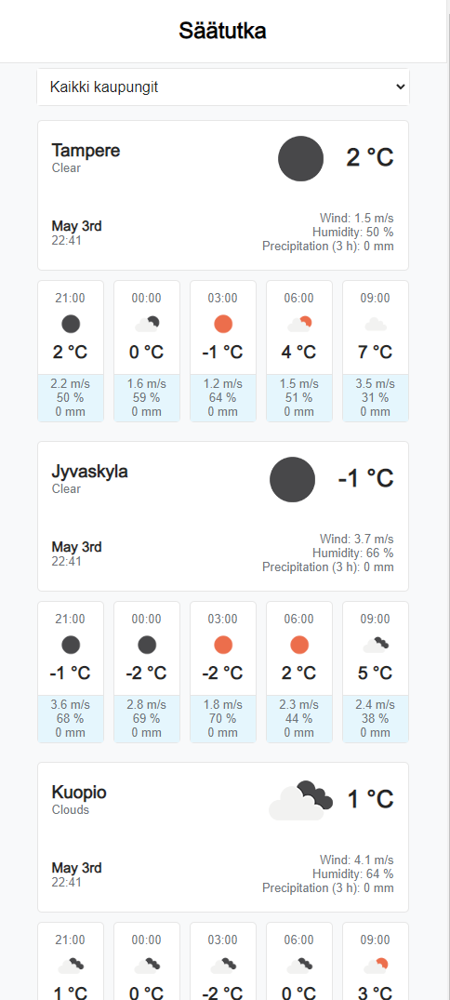
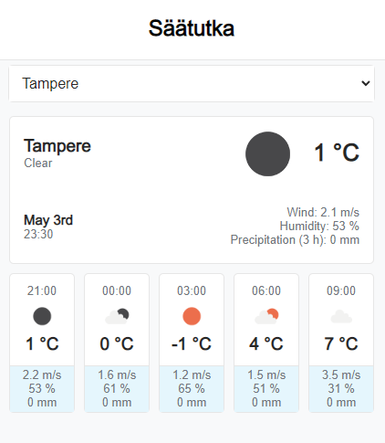

# weather-ette Frontend App

|             |                                                                                                                              |
| ----------- | :--------------------------------------------------------------------------------------------------------------------------- |
| Name        | Samuli Petäjistö                                                                                                             |
| Description | Web application showing current weather and forecast of four different finnish cities. Uses free plan of the OpenWeather API |
| Heroku link | https://weather-ette.herokuapp.com/                                                                                          |

3.5.2022

-App is deployed to Heroku and accessed through the link.

-App uses simple custom nodeJS backend solution hosted in Heroku

-API key is hidden through environment variables.

## Project Screen Shots

## Installation and Setup Instructions

#### Example:

Clone down this repository. You will need `node` and `npm` installed globally on your machine.

Installation:

`npm install`

To Start Server:

`npm start`

To Visit App:

`localhost:3000`
